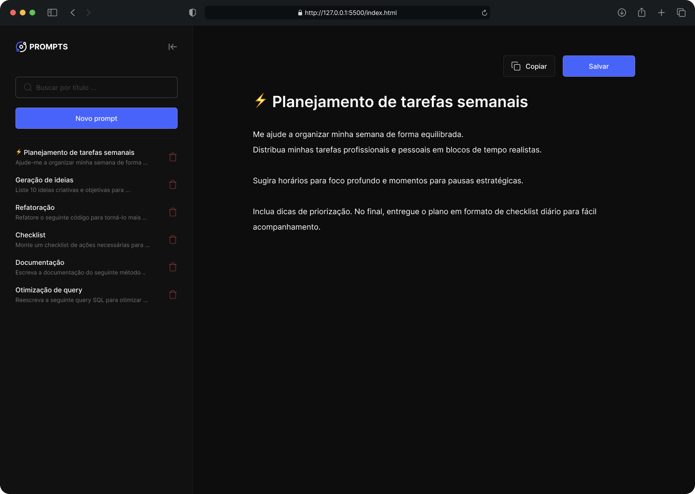

<h1 align="center">Prompt Manager</h1>

  <a href="#o-projeto">O Projeto</a>&nbsp;&nbsp;&nbsp;|&nbsp;&nbsp;&nbsp;
  <a href="#tecnologias">Tecnologias</a>&nbsp;&nbsp;&nbsp;|&nbsp;&nbsp;&nbsp;
  <a href="#layout">Layout</a>

  

---

## 💻 O Projeto 

O **Prompt Manager** é uma aplicação web para criar, organizar e reutilizar prompts de IA. O usuário pode escrever prompts com título e conteúdo formatado, salvá-los localmente no navegador, buscar por título e copiá-los com um clique — tudo sem precisar de backend ou banco de dados.

Os principais destaques do desenvolvimento incluem:

1. **Persistência com `localStorage`:** Os prompts são serializados em JSON e armazenados diretamente no navegador, sobrevivendo ao fechamento da aba sem nenhuma dependência de servidor.
2. **Edição rica com `contenteditable`:** O título e o conteúdo são campos `contenteditable`, permitindo formatação nativa (negrito, quebras de linha) sem bibliotecas externas. O estado de "vazio" é controlado via CSS com `::before` e a classe `.is-empty`.
3. **Sidebar responsiva com CSS puro:** O colapso da sidebar em telas menores é feito apenas com `classList` e variáveis CSS, sem nenhum framework — incluindo animação de `transform: translateX` para a entrada/saída em mobile.

---

## 🚀 Tecnologias 

* **HTML5:** Estrutura semântica da aplicação, com uso de `contenteditable` nos campos de edição e `data-*` attributes para controle de eventos na lista de prompts.
* **CSS3:** Layout principal com **Flexbox**, responsividade com `@media queries`, variáveis CSS (`custom properties`) para o sistema de cores, e pseudo-elementos `::before` para o comportamento de placeholder nos campos editáveis.
* **JavaScript:** Lógica completa da aplicação — gerenciamento de estado em memória, CRUD de prompts, filtragem por busca, persistência via `localStorage` e manipulação de DOM sem bibliotecas.
* **Git & GitHub:** Versionamento e deploy da aplicação.
* **Figma**

---

## 🔖 Layout 

Você pode visualizar e interagir com o projeto através dos links abaixo:

* 📲 **[Acesse o layout original do projeto aqui](https://www.figma.com/community/file/1554529095872857492)**
* 👉 **[Acesse o site funcionando aqui](https://alissonfa.github.io/nlw-21-prompt-manager/)**

**Para rodar no seu computador (Local):**
1. Faça o download ou clone o repositório.
2. Certifique-se de que a estrutura de pastas está correta.
3. Dê um duplo clique no arquivo `index.html` ou abra através da extensão *Live Server* no seu editor de código.

---

Feito com 💜 por **[AlissonFA](https://www.linkedin.com/in/alissonfa/)**